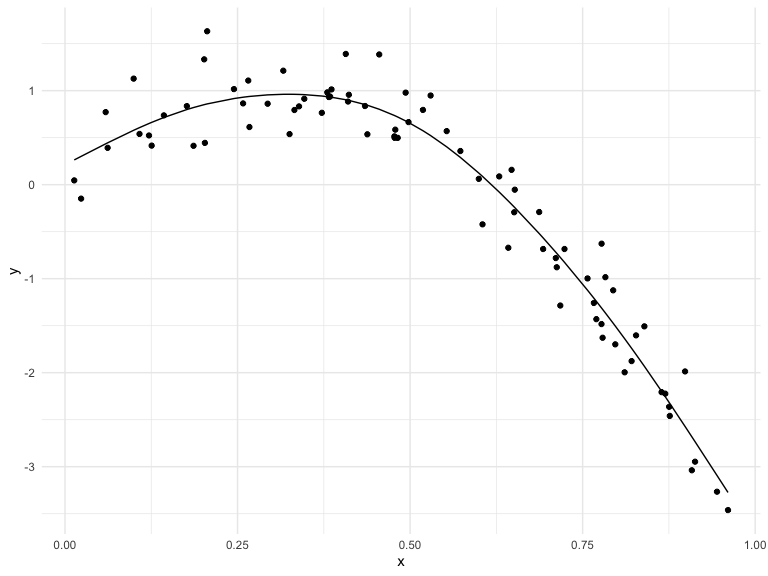
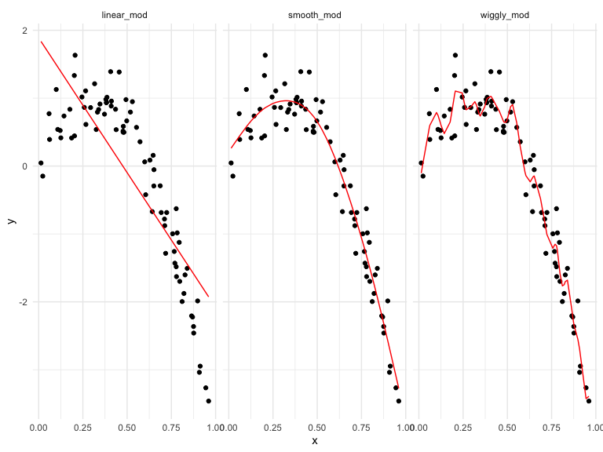

DSlecture19
================
Hening CUi
11/18/2021

    ## ── Attaching packages ─────────────────────────────────────── tidyverse 1.3.1 ──

    ## ✓ ggplot2 3.3.5     ✓ purrr   0.3.4
    ## ✓ tibble  3.1.5     ✓ dplyr   1.0.7
    ## ✓ tidyr   1.1.4     ✓ stringr 1.4.0
    ## ✓ readr   2.0.2     ✓ forcats 0.5.1

    ## ── Conflicts ────────────────────────────────────────── tidyverse_conflicts() ──
    ## x dplyr::filter() masks stats::filter()
    ## x dplyr::lag()    masks stats::lag()

    ## Loading required package: viridisLite

    ## Loading required package: nlme

    ## 
    ## Attaching package: 'nlme'

    ## The following object is masked from 'package:dplyr':
    ## 
    ##     collapse

    ## This is mgcv 1.8-38. For overview type 'help("mgcv-package")'.

## Simulate a dataset

``` r
set.seed(1)

nonlin_df = 
  tibble(
    id = 1:100,
    x = runif(100, 0, 1),
    y = 1 - 10 * (x - .3) ^ 2 + rnorm(100, 0, .3)
  )

nonlin_df %>% 
  ggplot(aes(x = x, y = y)) +
  geom_point()
```


Create spilts and plot and fit

``` r
train_df = sample_n(nonlin_df, 80)

test_df = anti_join(nonlin_df, train_df)
```

    ## Joining, by = c("id", "x", "y")

``` r
ggplot(train_df, aes(x, y)) +
  geom_point() +
  geom_point(data = test_df, color = "red")
```


fit model

``` r
linear_mod = lm(y ~ x, data = train_df)
smooth_mod = mgcv::gam(y ~ s(x), data = train_df)
wiggly_mod = mgcv::gam(y ~ s(x, k = 30), sp = 10e-6, data = train_df )
```

plot result

``` r
train_df %>% 
  add_predictions(smooth_mod) %>% 
  ggplot(aes(x, y)) +
  geom_point() +
  geom_line(aes(y = pred))
```



``` r
train_df %>% 
  add_predictions(wiggly_mod) %>% 
  ggplot(aes(x, y)) +
  geom_point() +
  geom_line(aes(y = pred)) #more complex
```


``` r
train_df %>% 
  gather_predictions(linear_mod, smooth_mod, wiggly_mod) %>% 
  mutate(model = fct_inorder(model)) %>% 
  ggplot(aes(x = x, y = y)) + 
  geom_point() + 
  geom_line(aes(y = pred), color = "red") + 
  facet_wrap(~model)
```



quatify result

``` r
rmse(linear_mod, test_df)
```

    ## [1] 0.7052956

``` r
rmse(smooth_mod, test_df)
```

    ## [1] 0.2221774

``` r
rmse(wiggly_mod, test_df)
```

    ## [1] 0.289051

## CV iteratively

use modelr::crossv_cv

``` r
cv_df =
  crossv_mc(nonlin_df, 100) # sampling 100 times

cv_df %>% pull(train) %>% .[[1]] %>% as.tibble()
```

    ## Warning: `as.tibble()` was deprecated in tibble 2.0.0.
    ## Please use `as_tibble()` instead.
    ## The signature and semantics have changed, see `?as_tibble`.
    ## This warning is displayed once every 8 hours.
    ## Call `lifecycle::last_lifecycle_warnings()` to see where this warning was generated.

    ## # A tibble: 79 × 3
    ##       id      x       y
    ##    <int>  <dbl>   <dbl>
    ##  1     1 0.266   1.11  
    ##  2     2 0.372   0.764 
    ##  3     3 0.573   0.358 
    ##  4     4 0.908  -3.04  
    ##  5     6 0.898  -1.99  
    ##  6     7 0.945  -3.27  
    ##  7     8 0.661  -0.615 
    ##  8     9 0.629   0.0878
    ##  9    10 0.0618  0.392 
    ## 10    11 0.206   1.63  
    ## # … with 69 more rows

``` r
cv_df = 
  cv_df %>% 
  mutate(
    train = map(train, as_tibble),
    test = map(test, as_tibble)
  )
```

lets fit some models

``` r
cv_df =
  cv_df %>% 
  mutate(
    linear_mod = map(.x = train, ~lm(y ~ x, data = .x)),
    smooth_mod = map(.x = train, ~gam(y ~ s(x), data = .x)),
    wiggly_mod = map(.x = train, ~gam(y ~ s(x, k = 30), sp = 10e-6, data = .x))
  ) %>% 
  mutate(
    rmselinear = map2_dbl(.x = linear_mod,.y = test, ~rmse(model = .x, data = .y)),
    rmsesmooth = map2_dbl(.x = smooth_mod,.y = test, ~rmse(model = .x, data = .y)),
    rmsewiggly = map2_dbl(.x = wiggly_mod,.y = test, ~rmse(model = .x, data = .y))
  )
```

look at output

``` r
cv_df %>% 
  select(starts_with("rmse")) %>% 
  pivot_longer(
    rmselinear:rmsewiggly,
    names_to = "model",
    values_to = "rmse", 
    names_prefix = "rmse"
  ) %>% 
  ggplot(aes(x = model, y = rmse)) +
  geom_boxplot()
```


## child growth

``` r
child_df = read_csv("nepalese_children.csv") %>% 
  mutate(weight_cp = (weight >7) * (weight-7))
```

    ## Rows: 2705 Columns: 5

    ## ── Column specification ────────────────────────────────────────────────────────
    ## Delimiter: ","
    ## dbl (5): age, sex, weight, height, armc

    ## 
    ## ℹ Use `spec()` to retrieve the full column specification for this data.
    ## ℹ Specify the column types or set `show_col_types = FALSE` to quiet this message.

``` r
child_df %>% 
  ggplot(aes(x = weight, y = armc)) +
  geom_point(alpha = .2)
```


consider candidate model

``` r
linear_mod = lm(armc ~ weight, data = child_df)
smooth_mod = gam(armc ~ s(weight), data = child_df)
pwl_mod = gam(armc ~ weight + weight_cp, data = child_df)
```

``` r
child_df %>% 
  add_predictions(pwl_mod) %>% 
  ggplot(aes(weight, armc)) +
  geom_point(alpha =.2) + 
  geom_line(aes(y = pred), color = "red")
```


USe CV

``` r
cv_df = 
  crossv_mc(child_df, 100)%>% 
  mutate(
    train = map(train, as_tibble),
    test = map(test, as_tibble)
  )
```

``` r
cv_df =
  cv_df %>% 
  mutate(
    linear_mod = map(.x = train, ~lm(armc ~ weight, data = .x)),
    smooth_mod = map(.x = train, ~gam(armc ~ s(weight), data = .x)),
    pwl_mod = map(.x = train, ~gam(armc ~ weight + weight_cp, data = .x))
  ) %>% 
  mutate(
    rmselinear = map2_dbl(.x = linear_mod,.y = test, ~rmse(model = .x, data = .y)),
    rmsesmooth = map2_dbl(.x = smooth_mod,.y = test, ~rmse(model = .x, data = .y)),
    rmsepwl = map2_dbl(.x = pwl_mod,.y = test, ~rmse(model = .x, data = .y))
  )
```

``` r
cv_df %>% 
  select(starts_with("rmse")) %>% 
  pivot_longer(
    rmselinear:rmsepwl,
    names_to = "model",
    values_to = "rmse", 
    names_prefix = "rmse"
  ) %>% 
  ggplot(aes(x = model, y = rmse)) +
  geom_boxplot()
```


